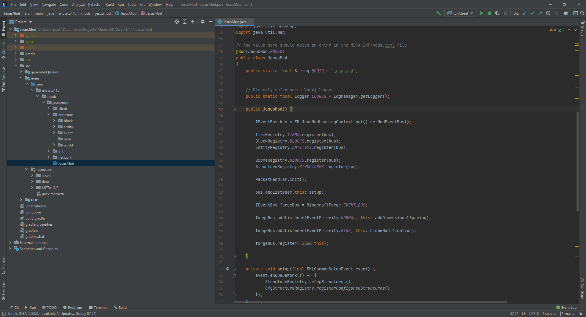
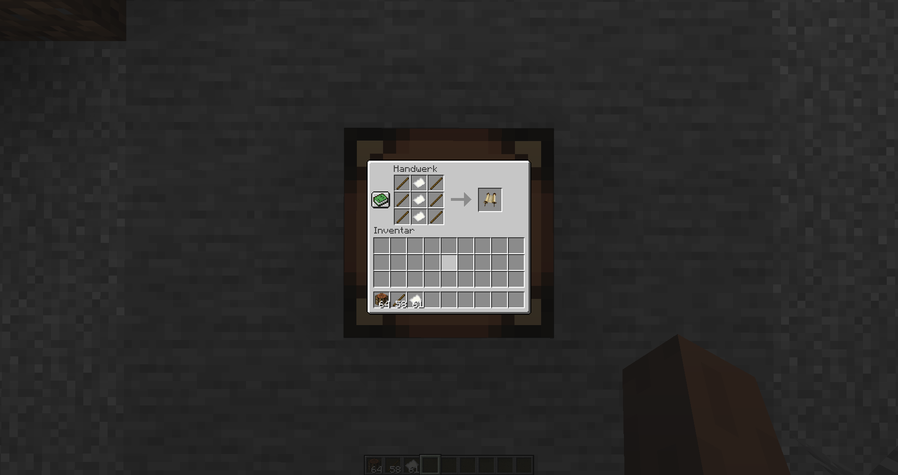
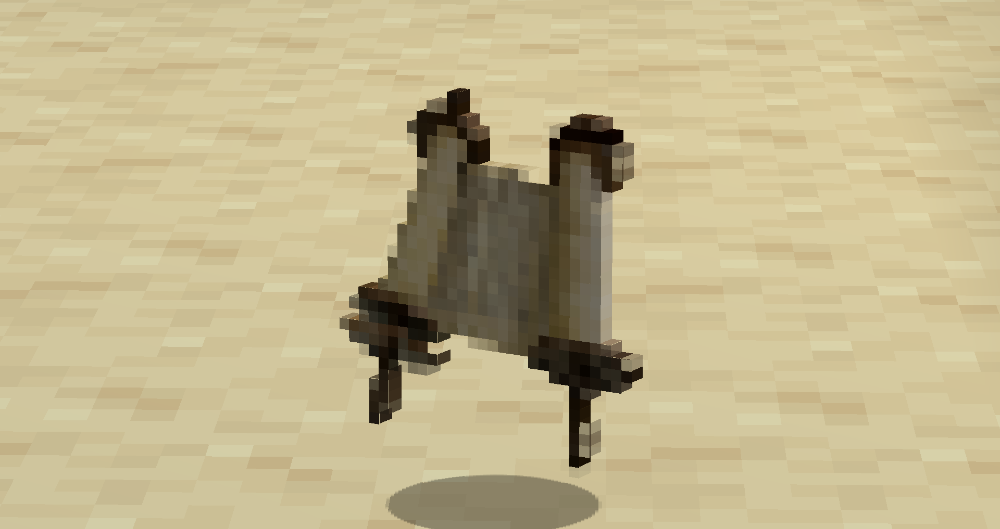
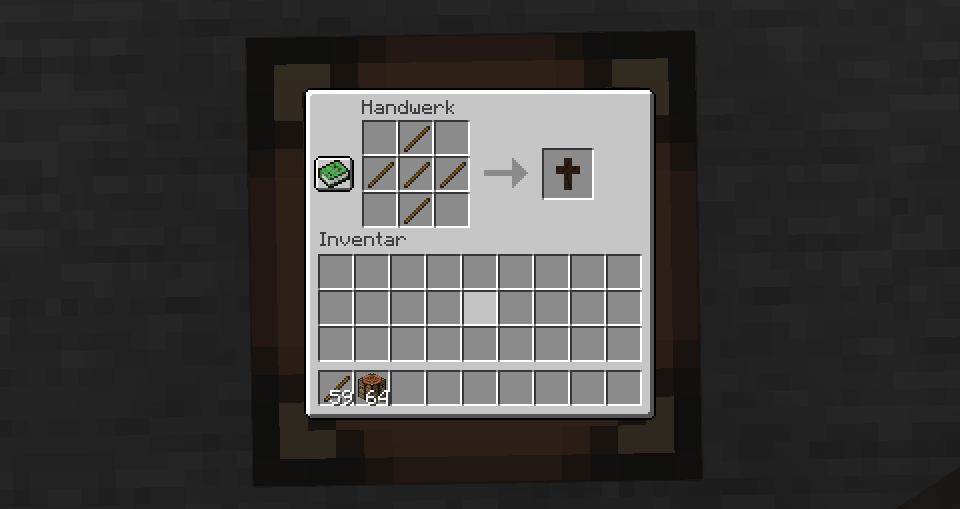
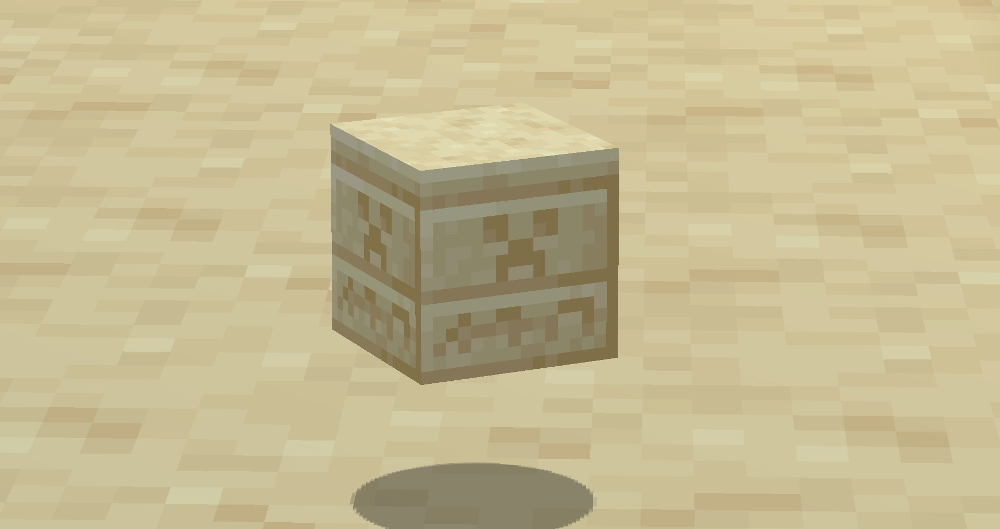
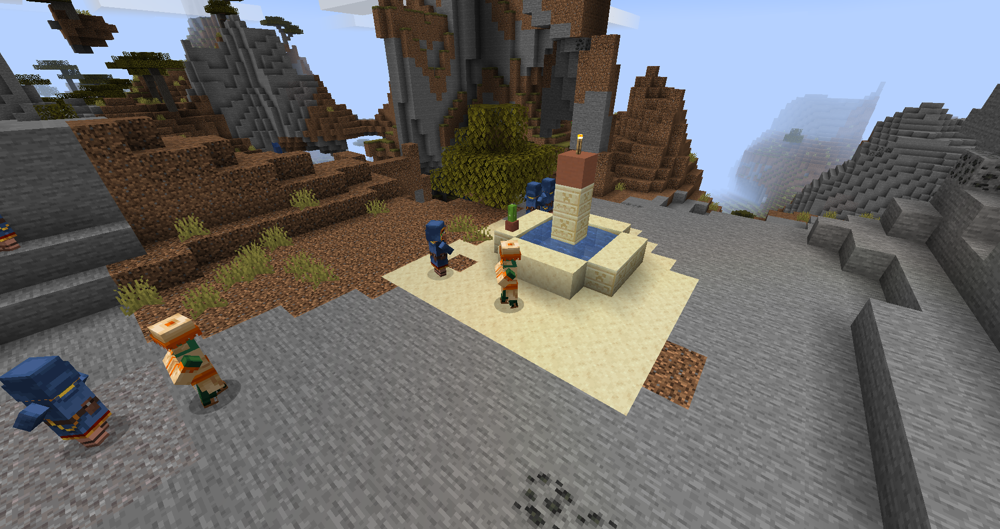
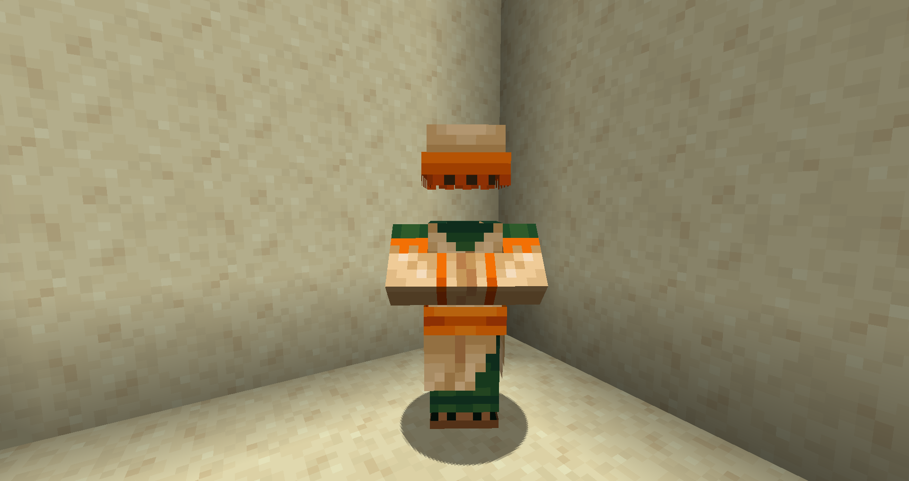
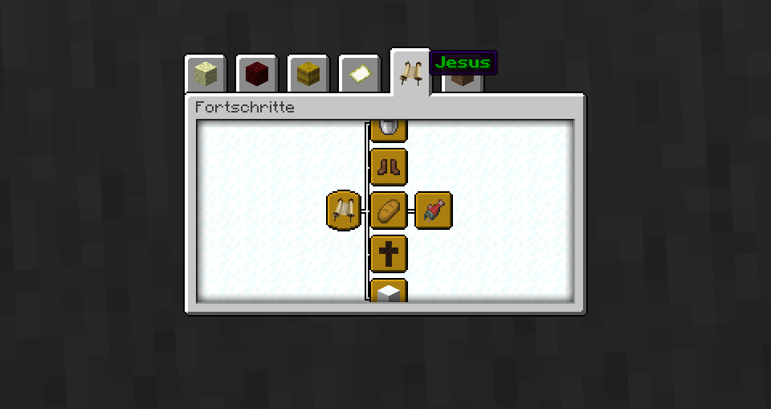

# JesusMod
# Präsentation

### Erstellt mithilfe von IntelliJ IDEA und Minecraft Forge 1.17.1

# Eigenschaften & Funktionen:
* ## Gegenstände & Blöcke
    * ### Tora
      
      
    * ### Kreuz
      
      
      
    * ### Altar
      
  
* ## Jünger & Treffpunkte
    
    
  
    Jünger erscheinen natürlich an Treffpunkten, zusammen mit Händlern und Dorfbewohnern. Durch Rechtsklick auf einen bestimmten Stein am Treffpunkt mit Brot oder Fisch erhält jeder Jünger, Händler und Dorfbewohner im Umkreis von 20 Blöcken Brot bzw. Fisch, die Jünger können diese Gegenstände aufheben.
  
    Ein Rechtsklick mit einer Tora auf einen Jünger sorgt dafür, dass dieser dem Spieler wie ein gezähmtes Tier hinterherläuft.

    Der Jünger wurde auf Basis eines Dorfbewohners erstellt, jedoch wird der Kopf-Teil des Models nicht angezeigt. Eventuell wird dieser Fehler noch korrigiert.

    [Video](https://www.youtube.com/watch?v=_y9x2qEe5_M)

* ## Wetter ändern
    Durch Drücken von 'C' bei Regen oder Gewitter wird das Wetter geändert und der Himmel ist wieder klar.

    [Video](https://www.youtube.com/watch?v=ipiAEvOa7qY)

* ## Kreuzigung & Auferstehung
    Leider konnte das Kreuz nicht in einer realistischen Größe erstellt werden, auch eine Animation bzw. Pose zur Kreuzigung war nicht möglich. 
    Durch Rechtsklick auf den Block werden mit der Zeit verschiedene Effekte angewandt, bis der Spieler schließlich schwebt und in die Himmels-Dimension versetzt wird. 
    Beim Dimensionswechsel können zur Zeit noch Spielabstürze auftreten.
    
    [Video](https://www.youtube.com/watch?v=eE55v1A5q20)

    Screenshots der Himmels-Dimension:
  
    
    
  
* ## Erfolge
    
  
    Zu jeder Funktion existiert mindestens ein Erfolg. Diese Erfolge können durch Drücken von 'L' im Reiter "Jesus" angesehen werden. Im Titel steht jeweils eine Stelle des Markus-Evangeliums, an der die passende Handlung nachgelesen werden kann, ein kurzes Zitat der Stelle steht außerdem in der Beschreibung.

    * ### Ändern des Wetters
      
    * ### Sammeln von Jüngern
      
    * ### Speisung der Menschen
      
      
    * ### Kreuzigung
      
    * ### Auferstehung
      
  